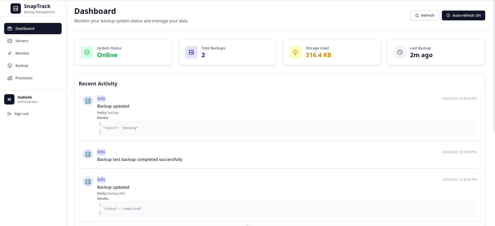
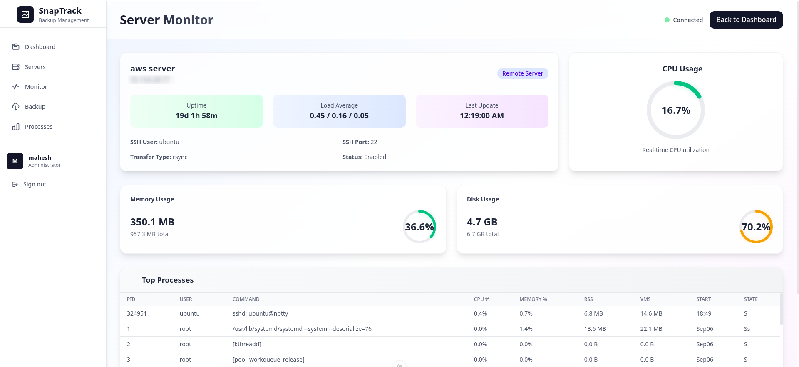
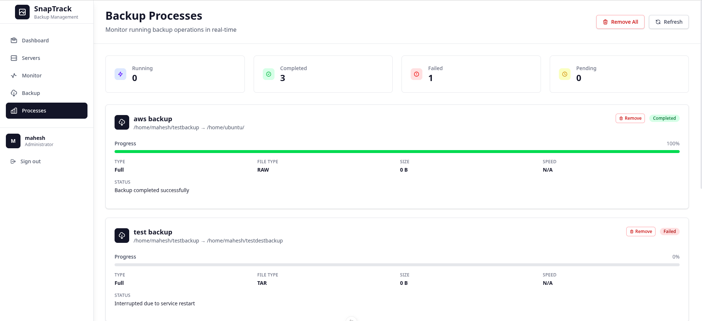
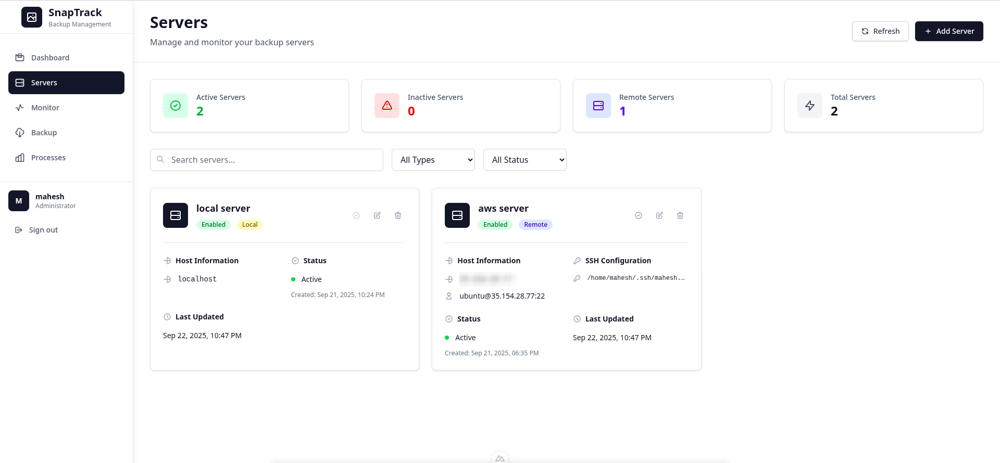
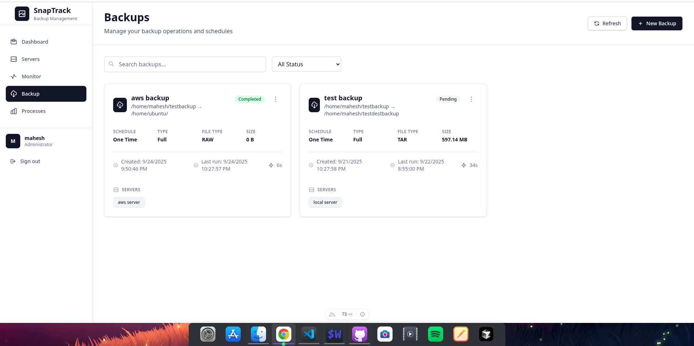

# SnapTrack Backup System

SnapTrack is a **backup monitoring and management system** built with **Go (Golang)** and **Nuxt.js / Vue 3**.  
It allows you to manage backups, monitor system status, and view recent activity in a clean dashboard.

## Features

- Real-time backup monitoring
- Dashboard with system stats
- Recent activity feed
- Support for local and remote servers
- Detailed backup logs with metadata
- Automatic and manual refresh

## Screenshots

### Dashboard


### Backup Monitor


### Processes


### Servers


### Backups


## Installation

1. Clone the repository:
```bash
git clone https://github.com/maheshbhatiya73/snaptrack.git
cd snaptrack
```

## Setup backend (Golang):
```bash
cd server
go run main.go
```

## Setup frontend (Nuxt.js):
```bash
cd web
npm install
npm run dev
```